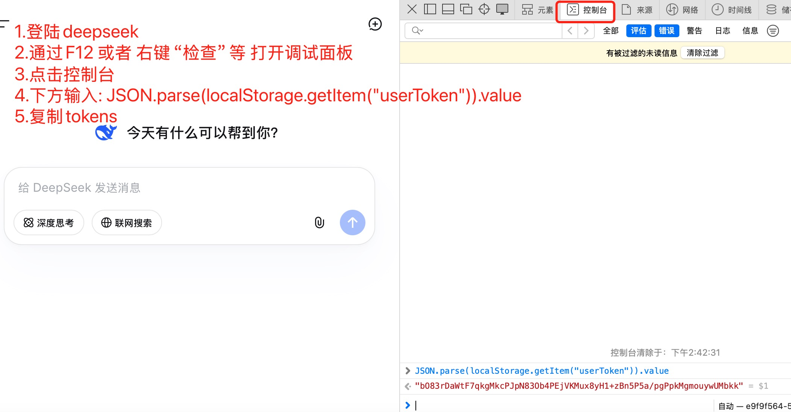

# DSK - DeepSeek API Go SDK

[](LICENSE)
[](https://golang.org)

这是 [deepseek4free](https://github.com/xtekky/deepseek4free) 项目的 Go 语言实现版本。提供了一个简洁的 Go SDK 来与 DeepSeek AI 聊天 API 交互。

## ✨ 功能特性

- 🔄 **流式响应**: 实时接收 token-by-token 的输出
- 🤔 **思考过程**: 可选的模型推理步骤可见性
- 🔍 **网络搜索**: 可选的实时信息集成
- 💬 **会话管理**: 持久化的聊天会话和对话历史
- ⚡ **高效 PoW**: 基于 WebAssembly 的工作量证明实现（已嵌入二进制）
- 🛡️ **错误处理**: 完善的错误处理机制
- ⏱️ **无超时**: 支持长时间运行的对话
- 🧵 **线程支持**: 支持父消息跟踪的线程对话
- 📦 **零依赖**: WASM 文件已嵌入，无需外部文件

## 📦 安装

```bash
go get github.com/minchieh-fay/dsk
```

或者克隆仓库：

```bash
git clone https://github.com/minchieh-fay/dsk.git
cd dsk
go mod download
```

## 🔑 获取认证 Token

要使用此 SDK，你需要一个 DeepSeek 认证 token。获取方法如下：

### 方法 1: 从浏览器 Console（推荐）

1. 访问 [chat.deepseek.com](https://chat.deepseek.com) 并登录
2. 打开浏览器开发者工具（F12 或右键 > 检查）
3. 切换到 Console 标签页
4. 运行以下命令：

```javascript
JSON.parse(localStorage.getItem("userToken")).value
```

5. 复制输出的 token 值



### 方法 2: 从 LocalStorage

1. 访问 [chat.deepseek.com](https://chat.deepseek.com) 并登录
2. 打开浏览器开发者工具（F12）
3. 转到 Application 标签页
4. 在左侧边栏，展开 "Local Storage"
5. 点击 "https://chat.deepseek.com"
6. 找到名为 `userToken` 的键
7. 复制 `"value"` 字段的值

## 🚀 快速开始

### 基本示例

```go
package main

import (
	"fmt"
	"os"

	"github.com/minchieh-fay/dsk/dsk"
)

func main() {
	// 请写入正确的 token
	// 获取方法：用浏览器打开 https://chat.deepseek.com，登录后，在 console 中运行：
	// JSON.parse(localStorage.getItem("userToken")).value
	token := "your_token_here"

	if token == "" {
		fmt.Fprintf(os.Stderr, "Error: Please set your DeepSeek token\n")
		os.Exit(1)
	}

	// 创建 API 客户端（WASM 文件已嵌入到二进制中）
	api, err := dsk.NewDeepSeekAPI(token)
	if err != nil {
		fmt.Fprintf(os.Stderr, "Error: %v\n", err)
		os.Exit(1)
	}
	defer api.Close()

	// 创建聊天会话
	chatID, err := api.CreateChatSession()
	if err != nil {
		fmt.Fprintf(os.Stderr, "Error: %v\n", err)
		os.Exit(1)
	}

	// 发送消息并接收流式响应
	chunkChan, errChan := api.ChatCompletion(chatID, "Hello, DeepSeek!", nil, false, false)

	for {
		select {
		case chunk, ok := <-chunkChan:
			if !ok {
				return
			}
			if chunk.Type == "text" {
				fmt.Print(chunk.Content)
			}
			if chunk.FinishReason == "stop" {
				return
			}
		case err := <-errChan:
			if err != nil {
				fmt.Fprintf(os.Stderr, "Error: %v\n", err)
				os.Exit(1)
			}
		}
	}
}
```

### 启用思考过程

```go
chunkChan, errChan := api.ChatCompletion(
	chatID,
	"Explain quantum computing",
	nil,
	true,  // thinking_enabled
	false, // search_enabled
)

for chunk := range chunkChan {
	if chunk.Type == "thinking" {
		fmt.Printf("🤔 Thinking: %s\n", chunk.Content)
	} else if chunk.Type == "text" {
		fmt.Print(chunk.Content)
	}
}
```

### 启用网络搜索

```go
chunkChan, errChan := api.ChatCompletion(
	chatID,
	"What are the latest developments in AI?",
	nil,
	true,  // thinking_enabled
	true,  // search_enabled
)

for chunk := range chunkChan {
	if chunk.Type == "thinking" {
		fmt.Printf("🔍 Searching: %s\n", chunk.Content)
	} else if chunk.Type == "text" {
		fmt.Print(chunk.Content)
	}
}
```

### 线程对话

```go
// 发送初始消息
var parentID *string
chunkChan, _ := api.ChatCompletion(chatID, "Tell me about neural networks", nil, false, false)

for chunk := range chunkChan {
	if chunk.Type == "text" {
		fmt.Print(chunk.Content)
	}
	if chunk.MessageID != "" {
		parentID = &chunk.MessageID
	}
}

// 发送后续问题
chunkChan, _ = api.ChatCompletion(
	chatID,
	"How do they compare to other ML models?",
	parentID,
	false,
	false,
)

for chunk := range chunkChan {
	if chunk.Type == "text" {
		fmt.Print(chunk.Content)
	}
}
```

## 📚 API 文档

### NewDeepSeekAPI

创建新的 API 客户端。

```go
func NewDeepSeekAPI(authToken string) (*DeepSeekAPI, error)
```

**参数:**
- `authToken`: DeepSeek 认证 token

**返回:**
- `*DeepSeekAPI`: API 客户端实例
- `error`: 错误信息

### CreateChatSession

创建新的聊天会话。

```go
func (api *DeepSeekAPI) CreateChatSession() (string, error)
```

**返回:**
- `string`: 聊天会话 ID
- `error`: 错误信息

### ChatCompletion

发送消息并获取流式响应。

```go
func (api *DeepSeekAPI) ChatCompletion(
	chatSessionID string,
	prompt string,
	parentMessageID *string,
	thinkingEnabled bool,
	searchEnabled bool,
) (<-chan Chunk, <-chan error)
```

**参数:**
- `chatSessionID`: 聊天会话 ID
- `prompt`: 要发送的消息
- `parentMessageID`: 父消息 ID（用于线程对话，可为 nil）
- `thinkingEnabled`: 是否启用思考过程显示
- `searchEnabled`: 是否启用网络搜索

**返回:**
- `<-chan Chunk`: 流式响应数据通道
- `<-chan error`: 错误通道

### Chunk 结构

```go
type Chunk struct {
	Type         string // "text" 或 "thinking"
	Content      string // 内容
	MessageID    string // 消息 ID（如果有）
	FinishReason string // 完成原因（如果有）
}
```

## 🏗️ 项目结构

```
dsk/
├── dsk/              # 核心包
│   ├── api.go        # API 客户端实现
│   ├── pow.go        # WASM PoW 求解器
│   ├── debug.go      # 调试工具
│   ├── utils.go      # 工具函数
│   └── wasm/         # WASM 文件（已嵌入）
│       └── sha3_wasm_bg.7b9ca65ddd.wasm
├── example/          # 示例代码
│   ├── go.mod
│   └── main.go
├── img/              # 文档图片
│   └── token.jpg
├── go.mod
├── go.sum
├── .gitignore
├── LICENSE
└── README.md
```

## 🔧 高级用法

### 使用自定义 WASM 文件

如果需要使用自定义 WASM 文件（例如用于测试），可以使用：

```go
api, err := dsk.NewDeepSeekAPIWithCustomWASM(token, "/path/to/custom.wasm")
```

### 启用调试模式

```go
dsk.EnableDebug = true
api, err := dsk.NewDeepSeekAPI(token)
// 现在会输出详细的调试信息
```

## ⚠️ 注意事项

- 本项目不包含 Cloudflare 绕过功能，如果遇到 Cloudflare 保护，请使用 Python 版本获取 cookies
- WASM 文件已嵌入到二进制中，无需额外的文件依赖
- 确保你的 token 有效且未过期
- 请遵守 DeepSeek 的使用条款和速率限制

## 🤝 贡献

欢迎提交 Issue 和 Pull Request！

## 📄 许可证

本项目采用 Apache-2.0 许可证。详见 [LICENSE](LICENSE) 文件。

## 🙏 致谢

- 原始 Python 实现: [deepseek4free](https://github.com/xtekky/deepseek4free)
- WASM 运行时: [wazero](https://github.com/tetratelabs/wazero)

## 📝 更新日志

### v1.0.0
- 初始版本
- 支持流式响应
- 支持思考过程和网络搜索
- WASM 文件嵌入到二进制中
- 完整的错误处理
